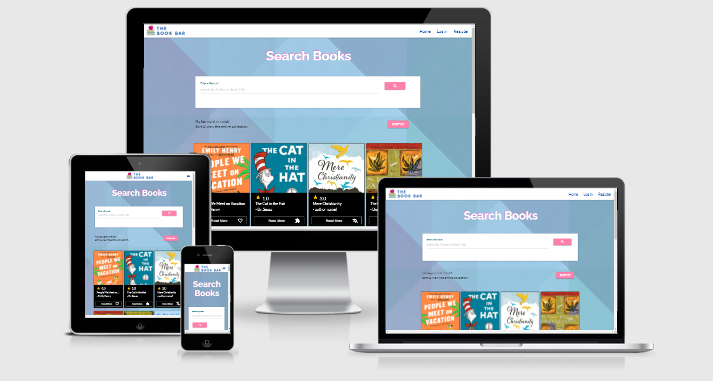

# The Book bar

## Data Centric Development - Milestone Project

[View the Live Site here.](https://the-book-bar.herokuapp.com/)

 




The Book bar was created by Emma Harte to serve readers worldwide.
Data driven, the website assists users in finding their next great read; offering both a book upload and recommendation service.
In this way, users are able to share opinions and knowledge with the greater Book bar community. 

In this project, full CRUD functionality is present. 
Security features are also present. Such include user permissions for the 'admin' user and safe storage of passwords and security-sensitive information.


----------------------------

## Contents
1. [UX](#ux)
      * [Strategy](#strategy)
      * [User Stories](#user-stories)
        * [Visitor Stories](#visitor-stories)
        * [Business Stories](#business-stories)
    * [Project Scope](#project-scope "goto project scope")
    * [Design](#design "goto design")
    * [Wireframes](#wireframes "goto wireframes")

2. [Features](#features "goto features")
    * [Existing Features](#existing-features "goto existing features")
    * [Features Left to Implement](#features-left-to-implement "goto features left to implement")

3. [Technologies Used](#technologies-used "goto technology used")

4. [Testing](https://github.com/emmahartedev/ms2-teachflow/blob/master/testing.md)
    
5. [Deployment](#deployment "goto deployment")

6. [Credits](#credits "goto credits")
    * [Content](#content "goto Content")
    * [Code](#code "goto code")
    * [Media](#media "goto media")
    * [Acknowledgments](#acknowledgments "goto acknowledgments")

----------------------------

## UX

### Strategy
The following information was declared during UX research, as part of the 5 plane investigation:

* The website will be created to target book lovers, of an age between 15 and 55.
  More specifically, the website aims to target tech-savy book lovers.

* Only useful, useable or essential data will be stored within the website.
  E.g., for books, data fields will include title, author, a cover image URL etc.

* In investigating in-scope features for this release, the Impportance v Feasibility was studied. Below is a graphic showcasing the results.

 

### User Stories

#### Visitor stories:
**As an external user**:

1. I want to be able to search for a book by book title or author, so that I can find out more information. 

2. I want to be able to search the database by genre, so that I can find a suitable book.

3. I want to be able to sort the entire database, so that I can view all books.

4. I want to be able to login or register for an account on the website, so that I can access my profile, upload books and add reviews.

5. I want to see a snapshot of activity on my profile, so that I can quicky see my recent contributions.

6. I want to be able to upload a book to the website, so that I and others can then review it.

7. I want to be able to make changes or delete a book that I have uploaded, in case an error has been made.

8. I want to be able to review and rate any book on the website, so that other users can quickly see what I thought about it.

9. I want to be able to edit and delete reviews that I have added, in case an error has been made.

10. I want to know the average star rating for each book, as this will help me choose my next read.

11. I want to know that my data is securely stored, as this is a worry of mine.


#### Business stories:
**As the website owner**:

1. I want to be able to add new book genres on the website, so that users can select these when uploading a book.

2. I want to be able to edit and delete book genres, in case an error has been made.

3. I want to see a snapshot of activity on my profile, so that I can quicky see my recent contributions.

4. I want to add a 'Buy now' link to each book so that I can potentially make money off click through sales.

5. I do not want to allow duplicate book titles to be published, this would lead to a bad customer experience.
 
6. I only want registered users (logged in) to be able to add reviews and books, for monitoring reasons.

7. I want to be able to edit and delete all content created on the website, for monitoring reasons.

### Project Scope
As part of the 5 plane investigation, the project scrope was defined.
During this process, the functional and content requirments were examined.
In considering the functional requirements, each problem was examined to find a best-fit solution.
In considering the content requirements, the following were questioned: 
  a) What type of content would fulfil the need (image, video, text, mixed)
  b) Whether or not adequate resources were available to produce the content.
The following is a statement of the findings:

**In scope (features & content)**

* User login and account registration
  - Only if a user is registered and logged in, can the user upload books and add reviews.

* An admin account for the website owener
  - Only with an 'admin' user account, can the user to edit & delete all content.
  - This is essential for website management and maintenace.

* A search bar
  - With search bar functionality, can a user find a book suitable to their needs.

* A search by book genre functionality. (nice to have)
  - By adding a search by genre layer, the user experience will be improved
  - A nice to have, not essential but to be considered if time is not an issue.

* Full CRUD functionality.
  - This should be present for two permission roles: 'admin' and non-admin users.
  - The 'admin' user should have full CRUD functionality for all content. 
  - Non-users should have full CRUD functionality for content they have created themselves.
  - The users actions should be reflected immediately on the front-end.

* Content will be mostly text and imagery
  - As this project is data-focused, less time will be spent on front-end development.

* A 'buy now' link will be added to each new book uploaded.  
  - This will allow the website owner to profit from book sales.

* Users will be able to add books and reviews
  - This is essential in creating a functional book recommendation service 

* A rating functionality will be added as part of each review
  - This is essential in creating a functional book recommendation service 

**Out of scope (features & content)**

* A sophisticated recommendation algorithm, based on books upvoted by user.
  - Not possible within the current time-frame and due to personal skillset

* A customised dashboard for users. The user will not be shown on their profile: recommendations.
    - Not possible within the current time-frame and due to personal skillset
    - The dashboard will include less sophisticated information such as recent contributions.

* Video banners, striking imagery & dynamic front-end development.
  - As this project is data-focused, less time will be spent on front-end development.

### Wireframes
All wireframes were created using the software [Balsamiq](https://balsamiq.com/). 
These layouts were created following research on the five planes of UX, and before coding.\
\
<strong>
Please note, the final website layout contains slight variations to the original wireframes.
Each of the following files contain wireframes for desktop, tablet, and mobile devices.
</strong>
 
**Users - not admin**
* [Home](assets/images/readmeFiles/wireframes/home.png)
* [Login](assets/images/readmeFiles/wireframes/login.png)
* [Register](assets/images/readmeFiles/wireframes/register.png)
* [Profile](assets/images/readmeFiles/wireframes/profile.png)
* [Add a book](assets/images/readmeFiles/wireframes/addABook.png)
* [Book page](assets/images/readmeFiles/wireframes/bookPage.png)

**User - admin only**
* [Manage categories](assets/images/readmeFiles/wireframes/manageGenresAdmin.png)

### Design
The website structure was designed to be consistent, predictable, learnable, visable and provide user feedback.
A user journey for non-admin users was created to aid the stuctural design.

 


#### Typography
All fonts used in this project derive from [Google Fonts](https://fonts.google.com/). 

Fonts used include:
* [Raleway](https://fonts.google.com/specimen/Raleway?query=raleway) - used for h1 - h4
* [Lato](https://fonts.google.com/specimen/Lato?query=lato) - used for h5 - h6 and all additional body text


#### Colour Scheme
A pink and blue colour palette was used in this design. Although contrasting, pink is associated with romance and lightness and blue creates a feeling of calmness. Used together, these colours create a positive mood.

The following colour palette was used for inspiration:


#### Design justifications
* 

--------------------------------------------------------------------------------------------

## Features

### Existing Features 

#### Elements on all pages

* **NavBar**
    - The navigation features The Book bar logo in the top left corner in desktop view. This switches to a center position on smaller screen sizes.

    - '''if 'user' in session''' is used by Python to check the logged-in status of the user, before allowing access to the page. This information is then passed to the jinja template.

    To determine which links are shown to the user, the Flask session object is used.
    Below are the lists of links shown for each user status.

    - For non admin users who **are not** logged in, the following links are viewable:
    1. Home 
    2. Login
    3. Register

    - For non admin users who **are** logged in, the following links are viewable:
    1. Home
    2. Profile
    3. Add a Book
    4. Logout

    - For admin users who **are** logged in, the following links are viewable:
    1. Home
    2. Profile
    3. Add a Book
    4. Manage Genres
    4. Logout


* **Footer**
    - The footer includes:
      - Copyright formation with a Github link
      - Social media links

#### Homepage

* **Search bar**
    - The user is able to search by author or book name
    - To search the entire database, a sort by function is available. The user can sort: 
      1. A-Z
      2. Z-A
      3. New-Old

    - Once a user makes a serach, the following occurs:

    - No results found:
      - No book cars are returned
      - The 'Sort by' button disapears
      - A no results message is displayed
      - A 'Reset' button is displayed, which redirects the user back to the homepage

    - Results found:
    - The matching book cards are returned
    - The 'Sort by' button disapears
    - A 'Reset' button is displayed, which redirects the user back to the homepage

* **Pagination**
    - Pagination is present on all three versions of the homepage. 
    - These include: Sorted by
      1. A-Z
      2. Z-A
      3. New-Old

    - On each page, 12 book cards are displayed 
    - This allows for faster page-load time and a better user experience

* **Book cards**
    - The book cards feature the book image, an average star rating, the book name, author and a genre icon.
    - The average review rating is updated once a review is uploaded or edited.
    - All card information is updated once a book is uploaded or edited.
    - The cards are styled with a dark-mode theme for easy viewing.

#### Bookpage
* **Book section**
  - The book image and book data are displayed in the first section
  - The book data section contains the following:
    * Book title
    * Average star rating
    * 'Buy Now' URL
    * Author
    * Description

  - Only if a **user** or **Admin** is logged in, the 'Edit' button will show. 


* **Posted Reviews section**
  - Each review posted is displayed on a card. The following are included:
    1. Review title
    2. Summary
    3. Review author
    4. Date posted
    5. Star rating

  - If a user is either **'Admin'** or the **review author** and they are logged in, the **edit** button is shown.


* **Add a review section**
- The 'Add a Review' form is only accessible to users who are **logged in**
  - if a user is **not logged in**, a message is displayed stating that they must log in to add a review.

- A user can only review each book, one time. This is noted on the review form. If a user tries to add a second review, they will also be notified
- The form contains the following fields
  1. Title
  2. Summary
  3. Select a star rating

- Upon saving, the average star rating value is also updated through a python function upon rending the bookpage template.


#### Edit book page
- The edit book page for each book is only accessible to logged in users. The user must be either the creater of the book or 'admin'.
- Three pathways are possible on this page: 
  - Save
  - Cancel (go back)
  - Delete
- The 'Save' option updates the book document with the users' input in the form. All of the following fields can be edited and saved:
  - Book Genre
  - Book Title
  - Author
  - Image URL
  - Blurb
  - Buy Now URL
- The cancel button redirects the user back to the bookpage.
- The delete button removes the book document from the collection. on click, a modal apears asking for confirmation of deletion. From here, the user can decide to confirm the deletion or go back to the current page.

- Users who are not logged in or are not the creater or author, will be redirected to an access denied page if entering this page is attempted.

#### Edit review page
- The edit review page for each review is only accessible to logged in users. The user must be either the creater of the review or 'admin'. 
- As the book information may be useful for review editing, this section has been included in the template.
- Three pathways are possible on this page: 
  - Save
  - Cancel (go back)
  - Delete
- The 'Save' option updates the review array object within the book document with the users' input in the form. All of the following fields can be edited and saved:
  - Title
  - Summary
  - Star rating

- Upon saving, the average star rating value is also updated through a python function upon rending the bookpage template. 

- The cancel button redirects the user back to the bookpage

- The delete button removes the review object from the book collection. On click, a modal apears asking for confirmation of deletion. From here, the user can decide to confirm the deletion or go back to the current page.

- Users who are not logged in or are not the creater or author, will be redirected to an access denied page if entering this page is attempted.

#### Login page
- A link to the registration page is displayed for easy access

- If the username exists in db, the password is checked.
  - if the password inputted matches the hashed password, the user is directed to the profile page.
  - If the password inputted does not match the hashed password, an error flash message is displayed and the usr is redirected to the login page

- if the username does not exist in db, an error flash message is displayed and the usr is redirected to the login page

#### Register page
- If the username does not exists in db:
  - A unique hashed password is generated
  - The username and hashed password are inserted as a new document to the users collection
  - The user is redirected to the login page

- if the username exist in db
  - An error flash message is displayed and the user is redirected to the login page

#### Manage genres
- The Manage Genres page is only accessible to the user 'admin', who must be logged in
- Users have the option to 'Add' a genre or manage the existing genres. These are shown on cards

* **Genre cards**
- The genre title & materialise icon is shown on each card, along with an 'Edit button'

#### Profile page
- The profile book page is only accessible to that particular logged in user. Python checks the authentifivation of the user by running if 
''' if username == session["user"]:''''
- Users who are not logged in or are not the creater or author, will be redirected to an access denied page if entering this page is attempted

* **Welcome section**
- The user is adressed by their usrname and is notified of how many days they have been a member of the bookbar

* **Profile card**
- A summary of the users activity is displayed. Two statistics are included:
  - **Books added:** An aggregation operation calcualted the count of books created by the user 
  - **Review:** An aggregation operation calcualted the count of reviews created by the user 
- A quick link to the homepage is provided

* **Books added**
If a user has added books:
- The 4 most recent books added by the user are shown
- This view automatically updates once the user adds a new book

If a user has not added any books:
- A card is dispalyed which notifies the user that the 4 most recent book uploads will appear in this section
- A quick link to the book upload page is added

* **Reviews added**
If a user has added reviews:
- The 4 most recent reviews added by the user are shown
- This view automatically updates once the user adds a new review

If a user has not added any reviews:
- A card is dispalyed which notifies the user that the 4 most recent reviews will appear in this section
- A quick link to the homepage is added

#### 404 page
- The 404 page is returned when a requested page cannot be found. This template incorporates the Book bar website styling and includes a link to the homepage.

#### Access denied page
- The access denied webspage is returned if a user requests a webpage which they do not permission to view. This template incorporates the Book bar website styling and includes a link to the homepage.

### Features Left to Implement
The following are features were not included in this release. These may be developed in the future:

* Email authentication for account registration
  - implement email authentication for users who are registering an account. This would be a requirement.

* Admin role creation
  - Create an 'administrator' role, which would give special permissions to users in this category.
  - Currently there can be only one 'Admin' user, this is the account with the username of 'admin'. Unfortunately, this solution is not scaleable.

* Search bar filters & sort by
  - Attempted to implemented this at the beginning of the project. The plan was to include a fiter for 'category' and a 'sort by' function. After several days, I decided to move on with the project and to come back to it once my knowledge is more advance. 

* Add verification on image, icon and 'Buy now' url:
  - With the current set up, no instant verification is available on working links, images or icons before form submittion. This is true across the add and edit genre and book pages.
  - This would ensure that no errors are made upon upload & would reduce website maintaince work load of the administrator. 

----------------------------

## Technologies Used
### Database

* [MongoDB Atlas](https://www.mongodb.com/) - Used as the primary database for storing and retrieving the information in the website

### Languages

* [HTML5](https://www.w3schools.com/html/) - Used for structuring the site pages.

* [CSS](https://www.w3schools.com/css/) - Used for styling the site pages.

* [Javascript](https://www.w3schools.com/js/DEFAULT.asp) - Used to make the website interactive.

* [Python](https://www.python.org/) - Used to create database driven functionalities.

### Libraries

* [jQuery](https://jquery.com/) - Used to make the website interactive.

* [PyMongo](https://pypi.org/project/pymongo/) - Used to make communication between MongoDB and Python.

* [Flask](https://flask.palletsprojects.com/en/2.0.x/) - Used to construct and render pages

* [Jinja](https://jinja.palletsprojects.com/en/3.0.x/) - used in conjunction with flask to display data from the backend.

* [Google Fonts](https://fonts.google.com/) - Used for typography.

* [Font Awesome](https://fontawesome.com/) - Used for footer Icons.

* [Google Icons](https://fonts.google.com/icons) - Used for all Icons (bar footer icons).

* [LottieFiles](https://lottiefiles.com/) - all free animations are sourced from here.

### Tools

* [Gitpod](https://www.gitpod.io/docs/) - Used as a development environment.

* [PIP](https://pip.pypa.io/en/stable/installing/) - Used for tool installions.

* [Git](https://www.gitpod.io/docs/) - Used to handle version control.

* [Github](https://github.com/) - Used for repository hosting.

* [Github Pages](https://pages.github.com/) - Used for site deployment.

* [Materialize](https://materializecss.com/about.html) - Used to develop the website design system.

* [Canva](https://www.canva.com/) - Used to create the brand logo

* [Adobe Photoshop](https://www.adobe.com/products/photoshop.html) - Used to resize and edit images.

* [Favicon.io](https://favicon.io/favicon-converter/) - Used for flavicon creation.

* [Chrome Dev tools](https://developers.google.com/web/tools/chrome-devtools) - Used for monitoring the responsiveness of the website.

* [LamdaTest](https://www.lambdatest.com/) - Used for monitoring the responsiveness of the website.

* [Am I Responsive](http://ami.responsivedesign.is/) - Used to create repsonsive images for different devices.

### Deployment

* [Heroku](https://id.heroku.com/login) - The cloud platform used to deploying the website.
----------------------------
## Testing
All testing documentation is stored in a separate testing file, which can be accessed [here](https://github.com/emmahartedev/The-Book-bar/blob/master/testing.md).

----------------------------

## Deployment

### Local Deployment
To run this project on your own IDE, ensure that the following are installed on your machine:

  * [Python 3](https://www.python.org/download/releases/3.0/)
  * [PIP](https://pypi.org/project/pip/)
  * [Git](https://git-scm.com/)
  * [A MongoDB Atlas account](https://www.mongodb.com/)

#### Forking the repository
To fork the repository, the following steps must be followed:
1. Navigate to the project repository [project repository](https://github.com/emmahartedev/The-Book-bar).

2. Click "Fork"; located on the top right of the screen.

3. You have successfully forked the repository. A copy of the original project will now be copied to your account.

4. Create an env.py file to store environmental variables. Add this to .gitignore to ensure it is not uploaded.

5. Run the application using the command: ```python 3 app.py```

#### Cloning the repository
To clone the repository, the following steps must be followed:

1. Navigate to the project repository [project repository](https://github.com/emmahartedev/The-Book-bar).

2. Click 'Code' and in the Clone with HTTPs, copy the provided repository URL. 

3. Open a terminal in your IDE.

4. Change the current working directory to the location you wish to generate the cloned directory.

5. Type ```git clone```, and then paste the URL from step 2. 

```
git clone https://github.com/emmahartedev/TeachFlow.git
```
6. Create an env.py file to store environmental variables. Add this to .gitignore to ensure it is not uploaded.

7. Run the application using the command: ```python 3 app.py```

### Heroku Deployment
To deploy The Book bar to Heroku, follow the following steps:
  1. create a ```requirements.txt``` file using the command ```pip freeze > requirements.txt```.
  2. Create a ```Procfile``` using the command ```echo web: python app.py > Procfile```.
  3. Add both files to Github by using ```git add```, then ```git commit -m "Add a relevent git message here'"``` and finally ```git push```.
  4. Navigate to the [Heroku](https://id.heroku.com/login) website. On the dashboard page, click "New", then click "Create new app". Add a name and a region.
  5. Connect the Heroku app to the Github repository. On the Heroku app dashboard, select the "Deploy" tab. Under "Deployment method", select "Github" and confirm.
  6. Navigate to the "Settings" tab in the app dashboard. Under "Config Vars" click "Reveal Config Vars".
  7. Set the following config vars:

  | Key | Value |
 --- | ---
DEBUG | FALSE
IP | 0.0.0.0
MONGO_URI | `mongodb+srv://<username>:<password>@<cluster_name>-qtxun.mongodb.net/<database_name>?retryWrites=true&w=majority`
PORT | 5000
SECRET_KEY | `<your_secret_key>`

8. In the Heroku app click on the "Deploy" tab and navigate to the "Manual Deployment" section. Confirm that the "master" brance is selected and click "Deply Branch".

9. The website is now successfully deployed.

----------------------------

## Credits 
The following material is not my own. Sources have been listed alongside a description of the content used. 

### Content
* [Python - secrets](https://docs.python.org/3/library/secrets.html) - used to generate random ids for each review

* [Web Gradients](https://webgradients.com/) - Used for inspiration to create the linear-gradient background


### Code
The following code was used directly in this project:
  * [codepen - hesguru](https://codepen.io/hesguru/pen/BaybqXv) - used to create the star rating bar for reviews

The following code has been modied in this project:
  * [stackoverflow - dippas](https://stackoverflow.com/questions/37127123/change-color-of-underline-input-and-label-in-materialize-css-framework/37127156) - used to change the color of the materialize input fields


###  Media
The images used on this website were obtained from the following sources:
<strong>
* The image alt attribute is used to describe each image below
</strong>

README.md:
* Colour palette: [Source](https://www.pinterest.de/pin/490681321896937815/)

Homepage
* No search results [Source](https://lottiefiles.com/web-player?lottie_url=https%3A%2F%2Fassets7.lottiefiles.com%2Ftemp%2Flf20_aKAfIn.json)

Bookpage
* Rating stars [Source](https://www.freepik.com/free-vector/star-rating-with-two-different-backgrounds_1014851.htm#page=1&query=star%20rating&position=2)

* No ratings yet star git [Source](https://lottiefiles.com/web-player?lottie_url=https%3A%2F%2Fassets4.lottiefiles.com%2Fpackages%2Flf20_twYDL9.json)

Profile page
* User icon [Source](https://www.flaticon.com/free-icon/user_747545?term=user&related_id=747545)

* Stacked books icon [Source](https://www.flaticon.com/free-icon/books_167756?term=books&page=1&position=35&page=1&position=35&related_id=167756&origin=search)

* No books added yet image [Source](books section boy https://images.pexels.com/photos/3457273/pexels-photo-3457273.jpeg?auto=compress&cs=tinysrgb&h=750&w=1260)

* No reviews added yet image [Source](https://www.pexels.com/photo/selective-focus-photography-of-person-using-iphone-x-1542252/


### Acknowledgments
* 
