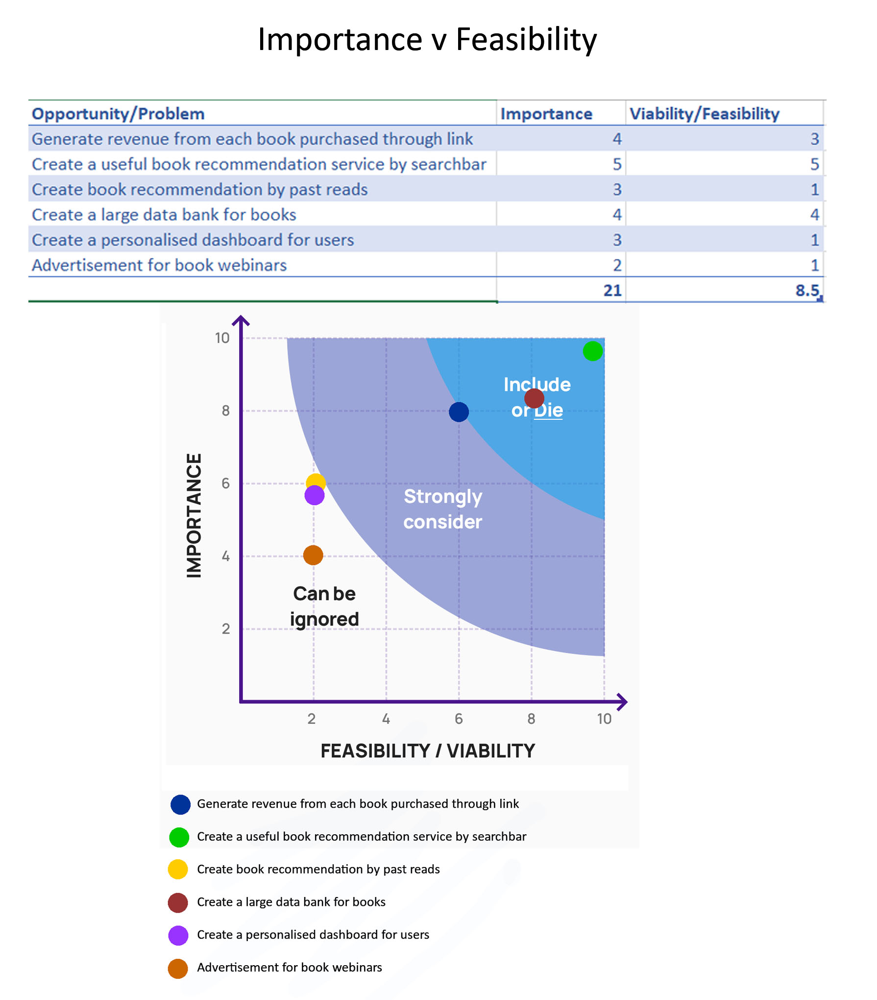
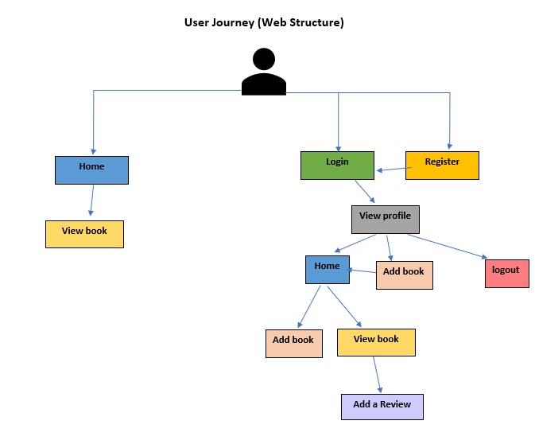

# The Book bar

## Data Centric Development Milestone Project

[View the Live Site here.]()

 


The Book bar website offers an online book review and recommendation service. 
This project is data focused, allowing users to share their own data with the greater
community of users.

The website has two main goals. For the user, finding a suitable book based on recommendations will be acheived.
For the website owner, a link will be added to each book uploaded which will allow them to earn money through each purchase.
sales pitch

----------------------------

## Contents
1. [UX](#ux "goto-ux")
    * [Overview](#overview "goto overview")
    * [User Stories](#user-stories "goto user stories")
    * [Project Scope](#project-scope "goto project scope")
    * [Design](#design "goto design")
    * [Wireframes](#wireframes "goto wireframes")

2. [Features](#features "goto features")
    * [Existing Features](#existing-features "goto existing features")
    * [Features Left to Implement](#features-left-to-implement "goto features left to implement")

3. [Technology Used](#technology-used "goto technology used")

4. [Testing](https://github.com/emmahartedev/ms2-teachflow/blob/master/testing.md)
    
5. [Deployment](#deployment "goto deployment")

6. [Credits](#credits "goto credits")
    * [Content](#content "goto Content")
    * [Code](#code "goto code")
    * [Media](#media "goto media")
    * [Acknowledgments](#acknowledgments "goto acknowledgments")

----------------------------

## UX

### The five plane

#### The Strategy plane
* The target audience for this website will be book lovers, of an age between 15 and 55.
The website aims to target tech-savy book lovers.
* The content stored on each book will include only relevent fields such as title, author and  a link to a cover image.
* Impportance v Feasibility was studied to ensure the most appropriate feature would be developed in this release.
Below are the results.
 

### User Stories

#### External user’s goals:
As an external user:
* I want to be able to login or register for an account on the website, so that I can access my profile and add reviews.

* I want to be able to upload a book (which does not already exist) to the website, so that I can then review it.

* I want to be able to add a review for a book and give it a thumbs up or thumbs down, so that other users can quickly see what I thought about it.

* I want to be able to edit and delete books and reviews I have added, in case I have made a mistake.

* I want to be able to search for a book by name of by author, so that I can view it's rating. 

* I want to be able to search the database by genre, so that I can find a suitable book.


#### Site Owner Goals:
As the website owner:
* I want to be able to manage the book genres so that this does not become disorganised.

* I want to add an affiliate link to each book so that I can potentially make money off each book.

* I do not want to allow duplicate book titles to be published, this would lead to a bad customer experience.
 
* I only want registerd users to be able to add reviews and books, for monitoring reasons.

* I want to be able edit and delete all content created on the website, for monitoring reasons.

### Project Scope
Functional and content requirments were examined to define what was in and what was out of scope.
For functional requirements, the problem was examined to find a best-fit solution.
For content requirements, the following were considered: What type of content would fulfil the need 
(image, video, text, mixed) and whether or not adequate resources were available to produce the content.

In scope (features & content)

* user login and account registration, only with this can books and reviews be added.

* An admin account for the website owener, this allows the user to edit & delete all content. The user can also manage the book genres.

* A search bar, where users can search for a book by title or author name.

* A search by book genre functionality. 

* Full CRUD functionality for users when dealing with the content they have created.

* Content will be mostly text and imagery, this data is data-focused with less emphasis on front-end development.

* A link will be added to each new book uploaded. This will demonstrate how the website owner could profit from book sales.

Out of scope (features & content)

* A star stating out of 5 for books. The user will only be able to upvote or downvote a book.

* A sophisticated recommendation algorithm, based on books upvoted by user.  

* A customised dashboard for users. The user will not be shown on their profile: recommendations or past reviews.

* Video banners, striking imagery & dynamic front-end development. 

### Wireframes
All wireframes were created using the software [Balsamiq](https://balsamiq.com/). 
Layouts were created following research on the five planes of UX, and before coding.\
\
<strong>
Please note, the final website layout contains slight variations to the original wireframes.
Each of the following files contain wireframes for desktop, tablet, and mobile devices.
</strong>
 
Users - not admin
* [Home](assets/images/readmeFiles/wireframes/home.png)
* [Login](assets/images/readmeFiles/wireframes/login.png)
* [Register](assets/images/readmeFiles/wireframes/register.png)
* [Profile](assets/images/readmeFiles/wireframes/profile.png)
* [Add a book](assets/images/readmeFiles/wireframes/addABook.png)
* [Book page](assets/images/readmeFiles/wireframes/bookPage.png)

User - admin only
* [Manage categories](assets/images/readmeFiles/wireframes/manageGenresAdmin.png)

### Design
The website structure was designed to be consistent, predictable, learnable, visable and provide user feedback.
A user journey was created to aid stucture design.

 


#### Typography
All fonts used are from [Google Fonts](https://fonts.google.com/). 

Fonts used include:
* Goudy Bookletter 1911
* Raleway
* Fredericka the Great (Logo)

#### Colour Scheme
A pink and blue colour palette was used in this design. Although contrasting, pink is associated with romance and lightness and blue creates a feeling of calmness. Used together, these colours create a positive mood.

The following colour palette was used for inspiration:


#### Design justifications
* 

--------------------------------------------------------------------------------------------

## Features

### Existing Features 
* **feature** 
    * notes

### Features Left to Implement
The following are features were not included in this release. These may be developed in the future:

* feature

----------------------------

## Technology Used

* [HTML5](https://www.w3schools.com/html/) - Used for structuring the site pages.

* [CSS](https://www.w3schools.com/css/) - Used for styling the site pages.

* [Bootstrap 4](https://getbootstrap.com/) - Framework used for building the site pages.

* [Javascript](https://www.w3schools.com/js/DEFAULT.asp) - Used to make the website interactive.

* [jQuery](https://jquery.com/) - Used to make the website interactive.

* [Leaflet](https://leafletjs.com/) - Used to create the maps.

* [SweetAlert](https://sweetalert.js.org/) - Used to create pretty alert boxes.

* [EmailJS](https://www.emailjs.com/) - Used to create the email service.

* [Google Fonts](https://fonts.google.com/) - Used for typography.

* [Adobe Photoshop](https://www.adobe.com/de/products/photoshop.html?sdid=88X75SKP&mv=search&ef_id=EAIaIQobChMI95Sd8Zyv7QIVA893Ch3SYQCaEAAYASAAEgI41vD_BwE:G:s&s_kwcid=AL!3085!3!341205896389!e!!g!!adobe%20photoshop!1419109629!54636022246&gclid=EAIaIQobChMI95Sd8Zyv7QIVA893Ch3SYQCaEAAYASAAEgI41vD_BwE) - Used to resize and edit images including the company logo and game tiles.

* [Font Awesome](https://fontawesome.com/) - Used for all Icons.

* [Gitpod](https://www.gitpod.io/docs/) - Used as a development environment.

* [Github](https://github.com/) - Used for repository hosting.

* [Github Pages](https://pages.github.com/) - Used for site deployment.

* [Chrome Dev tools](https://developers.google.com/web/tools/chrome-devtools) - Used for monitoring the responsiveness of the website.

* [LamdaTest](https://www.lambdatest.com/) - Used for monitoring the responsiveness of the website.

https://favicon.io/favicon-converter/ used to create flavicon

----------------------------
## Testing
All testing documentation is stored in a separate testing file, which can be accessed [here](https://github).

----------------------------

## Deployment
The website was hosted on Github Pages. It was deployed by carrying out the following steps:

1. login into Github.
2. Select the repository from the profile.
3. go to 'settings' in the repository.
4. In 'Github Pages' choose 'Master Branch' as Source and save.

The Live site deployed can be viewed on the following link: 
[TeachFlow](https://emmahartedev.github.io/TeachFlow/)

### Local
To clone this project locally; a Chrome browser and Github account are required. 

The following steps can then be followed:
1. Install the [Gitpod Browser Chrome Extention](https://chrome.google.com/webstore/detail/gitpod-dev-environments-i/dodmmooeoklaejobgleioelladacbeki), restarting the browser after installation.
2. Log into [Gitpod](https://gitpod.io/).
3. Click on the following link to go to the [project repository](https://github.com/emmahartedev/TeachFlow).
4. Click on the green 'Gitpod' button (which is located to the right of the repository) to launch a new workspace.
5. The code can be worked on in this newly launched workspace. 

To clone code within an IDE of your choice:

1. Click on the following link to go to the [project repository](https://github.com/emmahartedev/page).
2. Click 'Code' and in the Clone with HTTPs, copy the provided repository URL. 
3. Open a terminal in your IDE.
4. Change the current working directory to the location you wish to generate the cloned directory.
5. Type ```git clone```, and then paste the URL from step 2. 

```
git clone https://github.com/emmahartedev/ms2-page
```

----------------------------

## Credits 
The following material is not my own. Sources have been listed alongside a description of the content used. 

### Content

### Code
The following websites were used for inspiration and assistance:
*

The following scripts/plugins were used in the project:
* 

The following code has been directly used in this project:

* 

/* CREDIT https://codepen.io/dimitrisraptis96/pen/NWrrRLB*/
body background

https://docs.python.org/3/library/secrets.html
generating passwords

###  Media
The images used on this website were obtained from the following sources:
<strong>
* The image alt attribute is used to describe each image below
</strong>

In README.md:
* Colour palette: [Source](https://www.pinterest.de/pin/490681321896937815/)

In bookpage.html: 
* star [Source](https://www.freepik.com/free-vector/star-rating-with-two-different-backgrounds_1014851.htm#page=1&query=star%20rating&position=2)
user image on profile : https://www.flaticon.com/free-icon/user_747545?term=user&related_id=747545

* lottie file: https://lottiefiles.com/web-player?lottie_url=https%3A%2F%2Fassets4.lottiefiles.com%2Fpackages%2Flf20_twYDL9.json

lottie file book: https://lottiefiles.com/web-player?lottie_url=https%3A%2F%2Fassets7.lottiefiles.com%2Ftemp%2Flf20_aKAfIn.json
### Acknowledgments
* 
