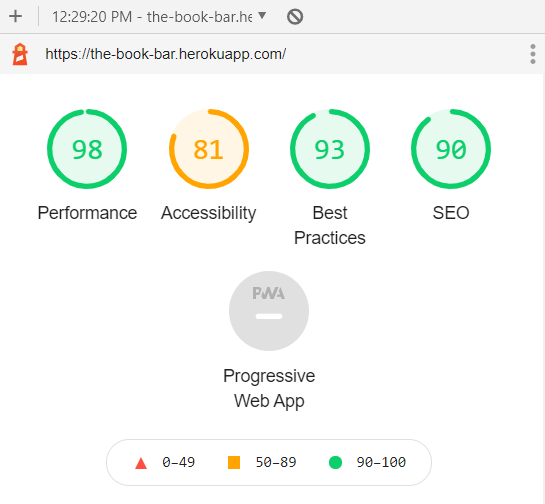
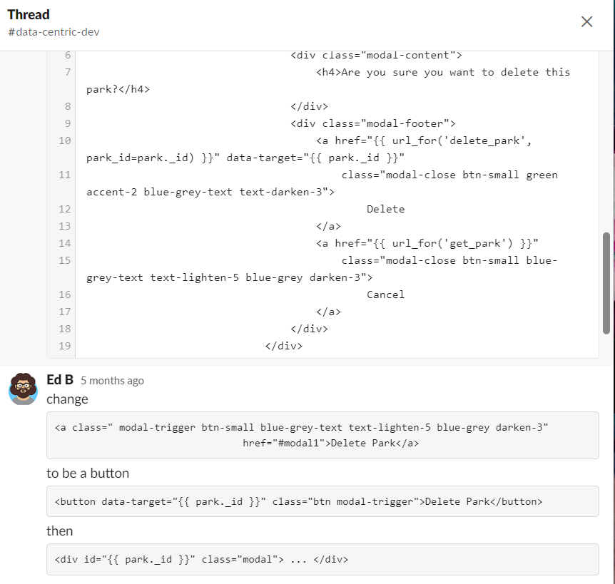

## The Book bar - Testing

- Click here to go back to the main [README.md](https://github.com/emmahartedev/The-Book-bar/blob/master/README.md) file. 

- Click here to view the live site on [Heroku](https://the-book-bar.herokuapp.com/).

### Table of Contents

1. [User Story Testing](#user-stories)
    - [Visitor stories](#visitor-stories)
    - [Business stories](#business-stories)

2. [Manual Testing](#manual-testing)
    - [Desktop testing](#desktop-testing)
    - [Mobile and Tablet testing](#mobile-and-tablet-testing)

3. [Browser Compatibility](#browser-compatibility)
4. [Responsiveness](#responsiveness)
    - [Chrome DevTools](#chrome-devtools)
    - [Lighthouse](#lighthouse)

4.  [Code Validation](#code-validation)
    - [HTML](#html)
    - [CSS](#css)
    - [Javascript](#javascript)
    - [Python](#python)

5. [Known Bugs](#known-bugs)
    - [Solved](#solved)
    - [Unsolved](#unsolved)

6. [Further Testing](#further-testing)

### User Stories
The following section re-evaluates the user stories which were defined in the UX section of [README.md](https://github.com/emmahartedev/The-Book-bar/blob/master/README.md).

#### Visitor stories:
**As an external user**:

1. I want to be able to search for a book by book title or author so that I can find out more information. 
    - A search index has been created.
        - This allows users to search by both book title and author.

    - If a search returns results:
        - The book cards are returned.
        - The book title and author are displayed on each book card, for easy readability.
        - By clicking on a card, the user can visit the book page.

    - If no results are returned:
        - The user is notified that no results were matched with the keyword used to search.
        - A reset button is displayed.

2. I want to be able to search the database by genre so that I can find a suitable book.

    - This feature has not been developed in this release:
        - This is noted in [README.md](https://github.com/emmahartedev/The-Book-bar/blob/master/README.md) under the Features left to implement section.
        - With a more advanced understanding of this concept, the development will be reconsidered at a later stage.

3. I want to be able to sort the entire database so that I can view all books.
    - A Sort by button is displayed on the homepage
    - The user can sort the collection by:
        - A-Z
        - Z-A
        - New-Old

    - The Sort by feature only sorts the entire collection:
        - Once a user searches by keyword, the Sort by button disappears.
        - As the database grows, it may become a requirement to apply Sort by to the results.
        - This development will be considered if the requirement arises.

4. I want to be able to log in or register for an account on the website, so that I can access my profile, upload books and add reviews.

    - Register and login pages are clearly located on the navbar:
        - A link to the login page is located on the register page, for users who have mistakenly navigated here.
        - A link to the register page is located on the login page, for users who have mistakenly navigated here

    - The register page contains clear messages:
        - The benefits of registering are displayed on the first line.
        - A link to the login page is included.
        - Username and password criteria are listed.

    - The register page contains clear feedback messages for form submission:
        - An error message is shown if the username is already in use.
        - An error message is shown if the password is too short.
        - A success message is shown if registration is successful.
    
    - The login page contains clear feedback messages with submission:
        - An error message is displayed if the password or username is incorrect.
        - A welcome message is displayed on the Profile page if registration is successful.


5. I want to see a snapshot of activity on my profile so that I can quickly see my recent contributions.

    - A welcome message is displayed:
        - The username is displayed.
        - The duration of time the user has been a member is displayed.

    - A snapshot of the user's activity is displayed. This icludes:
        - The total number of books the user has added.
        - The total number of reviews the user has added.
        - A quick link to the homepage.
    
    - A Recent contributions section is displayed. This includes:
        - The four most recent books added by the user.
            - To quickly navigate to the Edit book page, the user can click on the 'Edit Book' button. 
            - if a user has not added any books yet, a placeholder image and some text is displayed.

        - The four most recent reviews added by the user.
            - To quickly navigate to the Edit review page, the user can click on the Read More button. 
            - if a user has not added any reviews yet, a placeholder image and some text is displayed.

6. I want to be able to upload a book to the website so that I and others can then review it.
    - The Add a Book navlink is clearly visible on navbar.
    - The user can enter the following information on a book:
        - Book title
        - Author
        - Genre
        - Book image URL
        - Blurb
        - Buy now URL

7. I want to be able to make changes or delete a book that I have uploaded, in case an error has been made.
    - An Edit button is displayed within the Book page if the user has uploaded the book. This is also displayed for the 'admin' user.
    - Within the Edit page, the user has the option to delete the book.
    - Clicking delete activates a modal that asks for confirmation. before deletion

8. I want to be able to review and rate any book on the website so that other users can quickly see what I thought about it.
    - All users who are logged in can add a review to a book.
    - The review card contains the following fields:
        - Title
        - Summary
        - Star rating
    - An average star rating is updated with every review upload (upload load of the book page). With this aggregation, the user can quickly see what others thought of the book.

9. I want to be able to edit and delete reviews that I have added, in case an error has been made.
    - An Edit button is displayed behind a review card for the user who has uploaded the review. This is also displayed for the 'admin' user.
    - Within the Edit review page, the user has the option to delete the review.
    - Clicking delete activates a modal that asks for confirmation before deletion.

10. I want to know the average rating for each book, as this will help me choose my next read.
    - An average star rating is displayed for a book if at least one review has been posted
    - This is visible on both the book cards shown on the homepage and Profile page, as well as on the Book page itself.
    - The average star rating is updated each time a review is uploaded, edited, or deleted.

#### Business stories:
**As the website owner**:

1. I want to be able to add new book genres on the website, so that users can select these when uploading a book.
    - The Manage genres page is accessible only for the 'admin' user.
    - The link is clearly located on the navbar.
    - Within this page, the 'admin' user can add, edit, view and delete genres.

2. I want to be able to edit and delete book genres, in case an error has been made.
    - On the Manage genres page, the user is presented with a list of the current genres. The genre title, icon and an Edit button are displayed.
    - by clicking Edit, the user navigates to the Edit genre page. Here the user has the option to save changes, go back or delete the genre.
    - If changes are submitted on the Edit genre page, they immediately take effect across the entire site. (book cards on homepage, Book page etc.)
    - Clicking delete activates a modal which asks for confirmation before deletion.

3. I want to see a snapshot of activity on my profile, so that I can quicky see my recent contributions.

    - A welcome message is displayed:
        - The user's username is displayed.
        - The duration of time the user has been a member is displayed.

    - A snapshot of the user's activity is displayed. This includes:
        - The total number of books the user has added
        - The total number of reviews the user has added
        - A quick link to the homepage
    
    - A Recent Contributions section is displayed. This includes:

        - The four most recent books that were added by the user.
            - To quickly navigate to the Edit book page, the user can click on the Edit book button. 
            - if a user has not added any books yet, a placeholder image and some text is displayed.

        - The four most recent reviews that were added by the user.
            - To quickly navigate to the Edit review page, the user can click on the Read more button. 
            - If a user has not added any reviews yet, a placeholder image and some text is displayed.

4. I want to add a Buy now link to each book so that I can potentially make money off click-through sales.

    - A Buy now input field is provided as part of the upload book form submission
    - If blank, the Buy now link will not appear on the book page.
    - If provided, the Buy now link will be published on the book page.
    - Verification of the link has not been developed in this release:
        - This is noted in [README.md](https://github.com/emmahartedev/The-Book-bar/blob/master/README.md) under Features Left to Implement.
        - With a more advanced understanding of this concept, the development of this feature will be revisited at a later stage.
        - For now, it is ensured that "https://" is added to every shopping link. This prevents the user from entering a URL which will throw a Jinja error.

5. I do not want to allow duplicate book titles to be published, this would lead to a bad customer experience.

    - This feature has not been developed in this release:
        - This is noted in [README.md](https://github.com/emmahartedev/The-Book-bar/blob/master/README.md) under Features Left to Implement.
        - With a more advanced understanding of this concept, the development of this feature will be revisited at a later stage.
 
6. I only want registered users (logged in) to be able to add reviews and books, for monitoring reasons.

    - Access to the Add a book and review upload links has been restricted.
    - If a logged-out user attempts to access these pages, they will be redirected to the Access denied page.
    - On the Access denied page, a link to the homepage is displayed to direct users back to the site.

7. I want to be able to edit and delete all content created on the website, for monitoring reasons.

    - An Edit button is displayed behind every review card and book page for the 'admin' user.
    - Within the Edit (book, review, genre) page, the user has the option to delete the review or book.
    - Clicking delete activates a modal that asks for confirmation before deletion.
    - The 'admin' user has complete control over editing and deleting all content on the site.
    - The 'admin' user also has access to add both books and reviews.

### Manual testing
Manual testing was carried out on desktop, tablet, and mobile devices to ensure that the site works as expected. Below is an account of the findings.

#### Desktop testing
The following browsers were included in desktop manual testing:

    - Chrome
    - Firefox 
    - Microsoft Edge
    - Safari

**Elements on all pages**
1. Navbar
    - When the user is not logged in:
        - Hover on each link, confirm that hover effects are applied.
        - Click The Book bar brand logo, confirm navigation to the homepage.
        - Click the Register link, confirm navigation to the Register page.
        - Click the Login link, confirm navigation to the Login page.
        - Click the Login link, confirm that a session cookie is active.
        - Attempt to access the Profile page, Add a book page and Manage genres page. Confirm a redirect to the Access denied page.

    - When a user is logged in:
        - Click the Profile link, confirm navigation to the correct Profile page.
        - Click the Add a Book link, confirm navigation to the Add a book page.
        - Click Logout, confirm a redirect to the Login page and confirm that a session cookie is removed.

    - When 'admin' is logged in:
        - Click the Manage genres link, confirm navigation to the Manage genres page.

2. Footer
    - Hover over each icon, confirm that the hover effects are applied.
    - Click on the copyright icon, confirm navigation to Github profile.
    - Click on the copyright text, confirm navigation to Github profile.
    - Click on the facebook icon, confirm navigation to facebook.
    - Click on the facebook icon, confirm navigation to instagram.
    - Click on the twitter icon, confirm navigation to twitter.

**Homepage**
1. Search bar functionality
    - Search by Author's first name, confirm that the correct results are returned.
    - Search by the Author's last name, confirm that the correct results are returned.
    - Search by a word from the book title, confirm that the correct results are returned.
        - When results are returned, click on the Reset button. Confirm navigation to the homepage.
    - Search by a false keyword, confirm that a No results found message and a Reset button appear.
        - Click on the Reset button, confirm navigation to the homepage.

2. Sort by functionality
    - Sort by 'A-Z', confirm that the books are ordered correctly.
    - Sort by 'Z-A', confirm that the books are ordered correctly.
    - Sort by 'New-Old', confirm that the books are ordered correctly.
    - Search by a keyword, confirm that the Sort by button dissapears.
    

3. Pagination
    - Click on all pages in 'New-Old', confirm that the books are ordered correctly.
    - Click on all pages in 'A-Z', confirm that the books are ordered correctly.
    - Click on all pages in 'Z-A', confirm that the books are ordered correctly.
    - Confirm that each page displays 12 book cards.

3. Book cards
    - Confirm that a consistent layout in book cards is present. All contain:
        - A book image (where link has been successful, otherwise a placeholder image will show)
        - An average star rating (if a review exists)
        - Book title
        - Author
        - Genre icon
        - Read more button

    - Confirm that the average star rating is correctly aligned with the mongodb data.
    - Confirm that the book title and author are correctly aligned with the mongodb data.

**Bookpage**
1. Book section

    - For users logged out:
        - Confirm that the book information is correctly aligned with the mongodb data.
        - Confirm that the average star rating is correct.
        - Where no review has yet been added, confirm that a toolip is added.
        
    - For users logged in:
        - Confirm that the Edit button is not visible (unless the user is the content creator or 'admin')

    - For the 'admin' user or content creator:
        - Confirm that the Edit button is present.
        - Click the Edit button, confirm navigation to the Edit book page.

2. Posted Reviews section

    - For users logged out:
        - If reviews exist, confirm that the review cards are visible.
        - If no reviews exist, confirm that a placeholder card is displayed.

    - For users logged in:
        - If reviews exist, confirm that the review cards are visible.
        - If no reviews exist, confirm that a placeholder card is displayed.
        - On review cards, confirm that the Edit button is not visible (unless the user is the content creator or 'admin').
        - Confirm that the review information is correctly aligned with the mongodb data.
        - Confirm that the date is included.

    - For the 'admin' user or the content creator:
        - Confirm that the Edit button is present behind the review card.
        - Click on the Edit button, confirm navigation to the Edit review page.

3. Add a review section
    - For users logged out:
        - Confirm that the review form is not visible.
        - Confirm that a link to the log in page is provided.
            - Click on the link, confirm navigation to the Login page.

    - For users (all user types) logged in:
        - Confirm that the review form is present.
        - Submit a review:
            - Attempt posting a review without a title or rating, confirm failure.
            - Post a successful review.
                - Confirm that a success message appears. 
                - Confirm that the review card appears in the section above.
                - Confirm that the average rating updates in the book section.
            - Post a second review, confirm that an error message is displayed.

**Edit book page**
- Test access
    - Attempt to access the Edit book page URL while logged out. Confirm a redirect to the Access denied page.

- Test pathways
    - Input new data in all fields & click Save: 
        - Confirm that a success message appears.
        - Confirm a redirect to the Book page.
        - Confirm that the data on the page template is aligned with the MongoDB data (updated data).

  - Click Cancel:
    - Confirm a redirect to the Book page.

  - Click Delete:
    - Confirm that a warning message appears.
    - Click No:
        - Confirm that the modal closes.
    - Click Yes:
        - Confirm that a success message appears.
        - Confirm a redirect to the homepage.
        - Confirm that the correct book document is removed from the MongoDB books collection.
        - Confirm that the Books added count on the Profile page has updated.
        - Confirm that the book card within the Books added section on the Profile page dissapears.

**Edit review page**
- Test access
    - Attempt to access the edit book page URL while logged out. Confirm a redirect to the Access denied page.

- Test pathways
  - Input new data in all fields & click Save: 
    - Confirm that a success message appears.
    - Confirm a redirect to Book page.
    - Confirm that the data on the Book page is aligned with the MongoDB data (updated data).
    - Confirm that the average star rating in the book section has updated.

  - Click Cancel:
    - Confirm redirect to Book page.

  - Click Delete:
    - Confirm that a warning message appears.

    - Click No:
        - Confirm that the modal closes.

    - Click Yes:
        - Confirm that a success message appears.
        - Confirm redirect to Book page.
        - Confirm that the correct review object array has been removed from the MongoDB book collection.
        - Confirm that the Reviews added count on Profile page updates.
        - Confirm that review card within the Reviews added section dissapears.

**Login page**
- Incorrect password:
    - Confirm that an error message 'Password and/or Username is incorrect.' appears.

- Incorrect username:
    - Confirm that an error message 'Password and/or Username is incorrect.' appears.

- incorrect username and password:
    - Confirm error message 'Password and/or Username is incorrect.' appears.

- Correct username and password:
    - Confirm a redirect to Profile page.

**Register page**

- if the username is in use:
  - Confirm that an error message 'This username is already in use. Please choose another.' appears.

- If the username is not in use:
  - Confirm that a unique hashed password is generated.
  - Confirm that the username and hashed password are inserted as a new document to the users collection.
  - Confirm a redirect to the Login page.

**Manage genres page**

- Design confirmation:
    - Confirm that the genre cards show both the title and materialize icon.

- Test access
    - Confirm that the Manage genres navlink is not visible to non-admin users.
    - Confirm that the Manage genres navlnk is visible for the 'admin' user.
    - Attempt to access the Edit book page URL while logged out. Confirm a redirect to Access denied page.

- Test pathways
    - Click on the Add genre button, confirm a redirect to the Add genre page.
    - Click on the Edit button on a genre card, confirm a redirect to that specific Edit genre page.

**Add genre page** 
- Design confirmation
    - Confirm that two fields are present (genre name and materialize icon).

- Test pathways
    - Add data and click Save:
        - Confirm that a success flash message appears.
        - Confirm a redirect to Manage genres page.
        - Confirm that the newly added genre is present as a genre card, showing both the title and icon name.
        - Confirm that the newly added genre is visible in the dropdown field on the Add a book page.

    - Click Cancel:
        - Confirm a redirect to the Manage genres page.

**Edit genre page**
- Design confirmation
    - Confirm that two fields are present and pre-populated (genre name and the materialize icon).

- Test pathways
    - Edit data and click Save:
        - Confirm that a success flash message appears.
        - Confirm a redirect to the Manage genres page.
        - Confirm that the data on each genre card is updated and aligned with the MongoDB data.
        
    - Click Cancel:
        - Confirm a redirect to the Manage genres page.
    
    - Click Delete:
        - Click Yes:
            - Confirm that a success flash message appears.
            - Confirm a redirect to Manage genres page.
            - Confirm that the correct genre card has been removed and is aligned with MongoDB data.
            - Confirm that genre name and icon have been removed from all other areas on the site (books cards on homepage, Book page etc.).

**Profile page**
- Test access
    - Attempt to access a users profile by URL while logged out. Confirm a redirect to Access denied page.
    - Attempt to access a different users profile by URL while logged in. Confirm a redirect to Access denied page.

- Design confirmation
    - Welcome section:
        - Confirm that the correct username is displayed in the welcome message.
        - Confirm that the duration of membership displayed is correct.
    
    - Profile card
        - Confirm that the Books added count is correct.
        - Confirm that the Reviews added count is correct.
        - Hover over the Search books link, confirm that the hover effects are applied. 
        - Click on the Search books link, Confirm a redirect to homepage.

    - Books added section
        - If the Books added count = zero:
            - Confirm that a placeholder image and text are present.
            - Hover over the card link, confirm that the hover effects are applied.

        - If the Books added count > zero:
            - Confirm that the most recent 4 books added are displayed.

    - Reviews added section
        - If the Reviews added count = zero:
            - Confirm that a placeholder image and text are present.
            - Hover over the card link, confirm that the hover effects are applied.            

        - If the Reviews added count > zero:
            - Confirm that the most recent 4 reviews added are displayed.

**404 page**
- Test pathway 
    - Search using a false URL (eg https://the-book-bar.herokuapp.com/get_genres/crime).
    - Confirm a redirect to the 404 page.

**Access denied page**
- Test pathway
    - Search using a disallowed URL (eg https://the-book-bar.herokuapp.com//profile/emmaharte).
    - Confirm a redirect to Access denied page.

#### Mobile and Tablet testing
To test responsiveness on mobile and tablet devices, further manual testing was carried out. The following steps were carried out as part of this process.

**Elements on all pages**

- Navbar (max-width approx. 950px)
    - Confirm that the menu collapses into a burger icon.
    - Click on the burger icon, confirm that the menu slides in from the right.

- Footer
    - Confirm that the copyright and social media links sections stack on mobile devices.

**Homepage**

- Pagination
    - Confirm that the pagination works on mobile and tablet devices.

**Book page**
- Book section:
    - Confirm that the tooltip appears when the star icon (book section) is clicked.

**All pages**
- Content:
    - Confirm that the layout is optimized for mobile and tablet devices.
    - Confirm that all modal pop-ups behave as expected.

### Browser Compatibility
- [LamdaTest](https://www.lambdatest.com/) was used to test browser compatibility.
- All CRUD operations were carried out on each browser.
- The following browsers were tested:
    - Google Chrome
    - Firefox
    - Microsoft Edge
    - Safari 
    - Opera

-  No bugs were recorded during the LamdaTest testing process.

### Responsiveness

#### Chrome DevTools
- The website's responsiveness was tested using [Chrome DevTools](https://developers.google.com/web/tools/chrome-devtools) throughout development.
- This helped to ensure that responsiveness was optimized across a range of devices.
- The devices (and screen widths) tested include: 
    - iPhone 5/SE (320px)
    - iPhone 6/7/8 (375px)
    - iPhone 6/7/8 Plus (414px)
    - iPad (768px)
    - iPad Pro (1024px)
    - Laptop (1200px)
    - Desktop (1920px)

#### Lighthouse
- [Lighthouse](https://developers.google.com/web/tools/lighthouse) was run in Chrome Dev Tools regularly throughout development, to test the quality of the website.
- Reports were run for both mobile and desktop.

- The following screenshots show the final lighthouse reports. 

    - **Desktop**

        


    - **Mobile**

        

- Errors logged to the console:
    - **GET https://the-book-bar.herokuapp.com/robots.txt 404 (NOT FOUND)**:
        - No robots.txt file has been added to the project in this release. This will be added at a later stage.
    - **No Textarea element found**: 
        - These have been documented in the below Bugs section.


### Code Validation
#### HTML 
- All HTML code was checked using [The W3C Markup Validation Service](https://validator.w3.org/).

    - Changes made:
        - **Stray start tag script**
            -  Moved script tags to within the body tag.
        - **Remove ````href```` from button elements** 
            - Amended button element code.

    - Considerations for the future:
        - Add h2-h6 elements within each section, to create a stronger semantic structure. 

#### CSS
- All CSS code was checked using [The W3C CSS Validation Service](https://jigsaw.w3.org/css-validator/).
    - Errors present:
        - No errors were found, the document validates as CSS level 3 + SVG.

#### Javascript
* All Javascript code was checked using [JSHint](https://jshint.com/). 
    - Metrics:
        - There are 7 functions in the script.js.
        - The function with the largest signature takes 0 arguments, while the median is 0.
        - The largest function has 8 statements in it, while the median is 3.
        - The most complex function has a cyclomatic complexity value of 3 while the median is 2.

    - Errors present:
        - No errors were found.
        - Two warnings regarding the use of 'let' were issued. As these are not critical, no action was taken.

#### Python
- All Python code was checked using the online [PEP8 compliance](http://pep8online.com/) tool.
    - Changes made:
        - General changed were made to the code. These included indentation corrections, removal of trailing whitespace, and ensuring that two spaces were present between functions.
    
### Known bugs 

#### Solved
1. Modal pop-ups not working.
    - Issue:
        - Targeting the modal from within an ```<a>``` element did not cause the modal to pop up.

    - Resolution:
        - Solved by changing the ```<a>``` element to a ```<button>``` element. 
        - Thank you to the code institute slack channel for assistance on this.
        

2.  Clicking on the five-star rating bar causes a page to jump.
    - Issue:
        - When adding a review, adding a star rating is required. On click of a star, the page immediately jumped back up to the top of the page. Ideally, the star rating would become sticky after clicking and the page would remain in position.

    - Resolution:
        - After researching, I discovered that the reload behavior was caused by a line of CSS code.
        - The following code line was removed ```top:-9999px ```
        - Thank you to Pravin Waychal on Stack Overflow for assisting on this.
            - [Code from Stack Overflow](https://stackoverflow.com/questions/22881587/prevent-page-to-go-back-on-top-when-selecting-a-star-rating)

3. Invalid color incorrectly applied to select dropdown field.
    - Issue:
        - The select dropdown field is required in the Add a book and Edit book page templates. Even when a selection was made, the invalid class was applied.

    - Resolution:
        - Custom Jquery was added to correct this behavior.
        - Thank you to the code institute for providing this insight as part of the Milestone Three curriculum.

4. Delay on all modal pop-ups.
    - Issue:
        - A large delay between clicking on the modal trigger element and the modal pop-up was apparent. With this, it was not clear if submission/deletion or cancellation had been successful.

    - Resolution:
        - After researching, I discovered that the modal had not been initialized correctly.
        - I solved this by adding the following code: ```$('#modal1').modal().modal('open');```
        - Thank you to Denis Tsoi on Stack Overflow for assisting on this.
            - [Code from Stack Overflow](https://stackoverflow.com/questions/42430062/materialize-model-not-working)

5. Problematic URL structures.
    - Issue:
        - For each book, data is editable by the content creator or 'admin' user.
        - At the time, the book title was passed into the book page URL. 
        - If a user updated the book title, upon submission they would be redirected to the Book page.
        - The redirect caused a Jinja error. The URL was then invalid due to the changed book title.

    - Resolution:
        - The book title was removed from the Book page URL.
        - The book _id was instead passed to the book page URL.
        - This ensured that no URL issues could occur, as each ID is pernament to a document.

6. Deleting a genre when this is required for each book.
    - Issue:
        - As part of the CRUD operations, the 'admin' user needs to be able to delete a genre.
        - Once deleted, the genre_id also gets deleted in all books where it is featured.
        - If the user tried to edit a book with a deleted genre, the select dropdown field was strangely preselected to a random existing genre.

    - Resolution:
        - An 'I'm not sure' option was added to the genre dropdown field. 
        - This genre was hidden on the Manage genres page and the Book page.
        - Once a genre is deleted, the genre_id in the book document is replaced with the genre_id for the 'I'm not sure' document.
        - As this is hidden elsewhere in the site, the value is only visible from within the Edit book page.

7. Modal error logged to console on submission buttons.
    - Issue:
        - Upon click of a Submit button an error was logged to the console.
        - Error message:
            - "materialize.min.js:6 Uncaught TypeError: Cannot read property 'M_Modal' of null
            at HTMLBodyElement.value (materialize.min.js:6).
        - Error was present when all submit buttons were tested.
    
    - Resolution:
        - I first wrapped all submit buttons is an anchor tag, this did not work.
        - I next removed the following class from the buttons ```modal-trigger```.
        - This solved the issue, no errors were printed the console and it worked as it should.
        - Thanks to the following thread on GitHub for helping me to solve this bug:
            - [GitHub thread](https://github.com/InfomediaLtd/angular2-materialize/issues/335)

#### Unsolved
- No unsolved bugs are currently recorded.

### Further testing
- Asked family members and friends to test the website on their devices and record any bugs.
----------------------------
